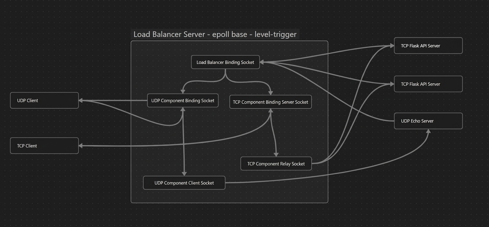

<div align="center">
  
  <h1>C++ Asynchronous Layer 4 Load Balancer</h1>
  <p>
    <strong>A high-performance, single-threaded L4 proxy utilizing Linux <code>epoll</code> for non-blocking I/O event multiplexing.</strong>
  </p>
  
  <p>
    
    
    
  </p>
</div>

<br />

## 📖 Overview

Traditional load balancers and web servers often rely on multi-threaded or multi-process architectures, leading to overhead in context switching, race conditions, and synchronization locks. 

This project tackles the **C10k problem** by implementing a **single-threaded, event-driven architecture**. By wrapping the Linux `epoll` API (level-triggered), it multiplexes thousands of non-blocking TCP and UDP sockets on a single thread. This approach mirrors the underlying architectures of industry titans like **Nginx** and **Redis**.

## ✨ Core Features

*   **⚡ Protocol Agnostic (L4)**: Seamlessly proxies and balances both connection-oriented (TCP) and connectionless (UDP) traffic.
*   **🔄 Zero-Thread Architecture**: Achieves extreme concurrency using non-blocking sockets and `epoll`, virtually eliminating CPU context-switching penalties.
*   **🔌 Dynamic Component Registration**: Backend microservices can dynamically connect, register, and deregister via a dedicated Msgpack control channel.
*   **🩺 Active Health Monitoring**: Performs scheduled health checks (5s intervals) to immediately evict failing backend nodes from the routing pool.
*   **⚖️ Round-Robin Distribution**: Deterministic traffic distribution across all healthy backend nodes for optimal resource utilization.

---

## 🏗️ Architecture & Control Flow

1.  **Control Channel Binding**: The Load Balancer opens a primary control TCP socket.
2.  **Dynamic Registration**: Backend nodes (Flask APIs, UDP servers) connect to the control port, transmitting a Msgpack payload specifying their target relay ports.
3.  **Port Allocation**: The Load Balancer dynamically binds the requested public-facing relay ports and adds them to the `epoll` watch list.
4.  **Traffic Forwarding**: Upon client connection, `epoll` triggers a read event. The Load Balancer ingests the packet, selects the next healthy node (Round-Robin), and relays the payload completely asynchronously.

---

## 📊 Performance Benchmarks (vs. Nginx)

The load balancer was rigorously benchmarked against an industry-standard **Nginx Reverse Proxy**. 

**Test Conditions:**
*   **Environment:** Ubuntu 22.04 (1 vCPU, 2GB RAM)
*   **Backends:** Python Flask (TCP) & Echo (UDP) performing blocking CPU loops (`for i in range(1, 5000000): count += i`).

### Latency Comparison (TCP)

| Workload | Backend Nodes | Nginx (Seconds) | Custom L4 Balancer (Seconds) |
| :--- | :---: | :---: | :---: |
| **10 Requests** | 2 | 1.57s | **1.60s** |
| **100 Requests** | 2 | 15.99s | **16.12s** |
| **300 Requests** | 2 | 47.61s | **49.83s** |

> **Architectural Takeaway**: At low-to-medium concurrency, this single-threaded proxy performs on par with Nginx. Under extreme burst loads (10,000+ simultaneous connections), Nginx's superior queue management yielded a 100% success rate, whereas this custom implementation experienced packet drops (57% success rate) due to socket buffer exhaustion—a textbook demonstration of TCP backlog limits.

---

## 🚀 Getting Started

### Prerequisites
*   `g++` (C++11 or higher)
*   `make`
*   `python3` (for test servers/clients)

### 1. Build and Run the Load Balancer
```bash
# Compile the project
make

# Run on a specified control port (e.g., 9988)
./lander 9988
```

### 2. Launch Backend Servers
*Requires: `pip install flask requests msgpack`*

```bash
cd clients

# Start a TCP backend (Local Port: 30000, Requesting LB to expose: 50000)
python3 api_server.py 127.0.0.1 9988 30000 50000

# Start a UDP backend (Local Port: 17000, Requesting LB to expose: 20000)
python3 udp_server.py 127.0.0.1 9988 17000 20000
```

### 3. Execute Load Tests
```bash
cd clients

# Simulate 100 concurrent TCP clients hitting the exposed port
python3 dummy_client.py 127.0.0.1 50000 100
```
